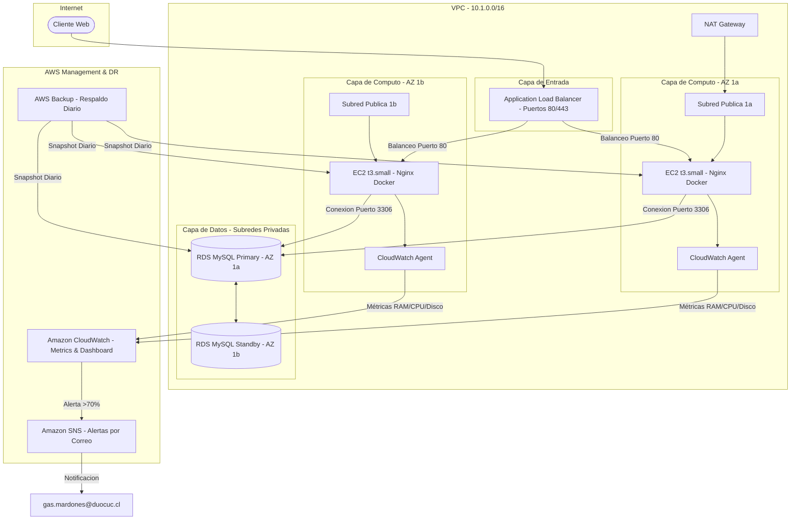

# TechNova Solutions - Alta Disponibilidad, Monitoreo y Respaldo en AWS

[](https://github.com/GMG-bit/AUY1105-Grupo-8/actions/workflows/main.yml)
[](https://github.com/GMG-bit/AUY1105-Grupo-8/actions/workflows/deploy.yml)
[](https://www.terraform.io/)
[](https://registry.terraform.io/providers/hashicorp/aws/latest)
[](LICENSE)

Infraestructura como Código (IaC) con Terraform para el despliegue automatizado de una arquitectura robusta de **Alta Disponibilidad (HA)**, **Monitoreo Continuo** y **Recuperación ante Desastres (DR)** en AWS para la plataforma de e-commerce de **TechNova Solutions**. Desarrollada como parte de la asignatura *AUY1105 – Infraestructura como Código II*.

---

## 👥 Integrantes - Grupo 8

* **Gaston Mardones** — [@GMG-bit](https://github.com/GMG-bit)
* **Benjamin Duran** — [@BenjaminDuran](https://github.com/BenjaminDuran)
* **Pablo Contreras** — [@pacontrerasj](https://github.com/pacontrerasj)

---

## 🏗️ Arquitectura del Sistema (HA & DR)

La solución implementa una infraestructura premium de tres capas distribuida de manera redundante en múltiples zonas de disponibilidad (**us-east-1a** y **us-east-1b**):



### Características de Alta Disponibilidad (HA):
1. **Balanceador de Carga (ALB):** Distribuye el tráfico entrante de forma balanceada por HTTP (Puerto 80) e HTTPS (Puerto 443) hacia las instancias EC2 saludables, realizando chequeos de salud automatizados.
2. **Auto Scaling Group (ASG):** Garantiza resiliencia horizontal permanente (**mínimo: 2, deseado: 2, máximo: 3**) utilizando Launch Templates basados en instancias **`t3.small`** con **50 GB gp3 SSD cifrado**. Si un nodo falla, el ASG aprovisiona otro de forma automática (Self-Healing).
3. **Base de Datos Multi-AZ:** Migración a **RDS MySQL 8.0** de tipo **`db.t4g.small`** (2 vCPU, 2 GB RAM) con **50 GB gp3 SSD cifrado** en subredes privadas. Mantiene una réplica síncrona en standby que asume la operación en segundos ante fallas de la base de datos primaria (Failover automático).

---

## 📊 Sistema de Monitoreo y Alertas

1. **Amazon CloudWatch Agent:** Instalado de forma desatendida mediante el `user_data` de las instancias. Captura métricas a nivel de sistema operativo:
   * Uso de **CPU Activa** (`cpu_usage_active`).
   * Porcentaje de **Memoria RAM** utilizada (`used_percent`).
   * Porcentaje de **Disco** consumido en la raíz (`/`).
   * Tráfico de **Red** entrante/saliente (`bytes_sent` / `bytes_recv`).
2. **Alarmas y Notificaciones Automáticas (Amazon SNS):**
   * Configurado un tema de SNS con suscripción de correo electrónico por defecto a **`gas.mardones@duocuc.cl`**.
   * Alarma de CPU alta activa si el ASG supera el **70%** por más de 2 minutos.
   * Alarma de Memoria RAM alta activa si las instancias superan el **70%** por más de 2 minutos.
3. **Dashboard Ejecutivo y Técnico:** Panel visual dinámico en la consola de CloudWatch que unifica las métricas del ASG, de la base de datos RDS, la memoria RAM del CWAgent y las peticiones procesadas por el ALB.

---

## 💾 Política de Respaldos (DR)

Implementación automatizada de **AWS Backup** de nivel profesional:
* **Bóveda de Respaldo:** Creada de forma centralizada y encriptada (`aws_backup_vault`).
* **Plan de Respaldo:** Definido un plan de respaldo programado **diario** con **retención automática de 7 días** para control de costes y cumplimiento operativo.
* **Selección de Recursos:** Selección automática de las instancias del ASG a través de la etiqueta `BackupClass = "DailyBackup"`, y selección directa por ARN de la base de datos RDS MySQL, utilizando el rol institucional `LabRole`.

---

## 🔒 Cumplimiento de Políticas y Gobernanza (OPA)

El proyecto incluye auditorías de calidad y seguridad integradas en el pipeline de CI/CD:
* **Validación de Capacidad:** Las políticas escritas en Rego (`policies/terraform_security.rego`) auditan las plantillas de lanzamiento y deniegan cualquier tipo de cómputo que difiera del estándar **`t3.small`** asignado a TechNova Solutions.
* **VPC Flow Logs:** Todo el tráfico de la red VPC es registrado activamente y auditado en CloudWatch Logs con cifrado de llaves KMS.

---

## 🛠️ Requisitos Previos

* [Terraform](https://developer.hashicorp.com/terraform/install) >= 1.0.0.
* [AWS CLI](https://docs.aws.amazon.com/cli/latest/userguide/install-cliv2.html) configurado con las credenciales de tu **AWS Academy Learner Lab**.
* Key Pair `vockey` disponible en la región `us-east-1` (Estándar de laboratorios de AWS).
* Bucket S3 configurado para el backend remoto.

---

## 🚀 Despliegue de la Infraestructura

1. **Clonar e Inicializar Backend Remoto:**
   ```bash
   git clone https://github.com/GMG-bit/AUY1105-Grupo-8.git
   cd AUY1105-Grupo-8

   terraform init \
     -backend-config="bucket=NOMBRE_DE_TU_BUCKET_S3" \
     -backend-config="key=auy1105/terraform.tfstate" \
     -backend-config="region=us-east-1"
   ```

2. **Validar Sintaxis e Integridad de IaC:**
   ```bash
   terraform validate
   ```

3. **Planificar el Despliegue:**
   ```bash
   terraform plan -var="project_name=grupo8" -var="key_name=vockey"
   ```

4. **Aplicar Infraestructura (Despliegue HA):**
   ```bash
   terraform apply -var="project_name=grupo8" -var="key_name=vockey"
   ```

---

## ⚙️ Variables del Módulo Raíz

| Variable | Descripción | Tipo | Default |
|---|---|---|---|
| `project_name` | Nombre clave para etiquetar todos los recursos de TechNova | `string` | — |
| `key_name` | Nombre del Key Pair de AWS para acceso SSH | `string` | — |
| `ssh_allowed_cidr` | CIDR permitido para acceso SSH | `string` | `0.0.0.0/0` |
| `subscription_email` | Correo electrónico receptor de alertas de CloudWatch | `string` | `gas.mardones@duocuc.cl` |
| `cpu_alert_threshold` | Umbral porcentual para alertas de CPU | `number` | `70` |
| `memory_alert_threshold`| Umbral porcentual para alertas de Memoria RAM | `number` | `70` |

---

## 📋 Verificación Operacional (Continuidad de Negocio)

Tras el despliegue exitoso, puedes realizar las siguientes simulaciones indicadas en la **[Guía de Pruebas (walkthrough.md)](file:///C:/Users/timti/.gemini/antigravity/brain/5e7d482d-3a85-47f6-9b9e-43e4a39e26b4/walkthrough.md)**:

1. **Tolerancia a Fallos de Servidores:** Termina una instancia EC2 activa y comprueba que el sitio sigue online gracias al ALB y que el ASG regenera la instancia automáticamente.
2. **Failover de Base de Datos:** Realiza un reinicio con failover de RDS MySQL y observa cómo el tráfico conmuta de AZ en segundos.
3. **Simulación de Cargas:** Estresa el procesador de una de las instancias y verifica la llegada de la notificación de alerta de CloudWatch a tu correo electrónico de suscripción.
4. **Respaldos de AWS Backup:** Verifica los puntos de recuperación listados dentro del panel de AWS Backup para restaurar volúmenes o bases de datos RDS a un estado previo.
